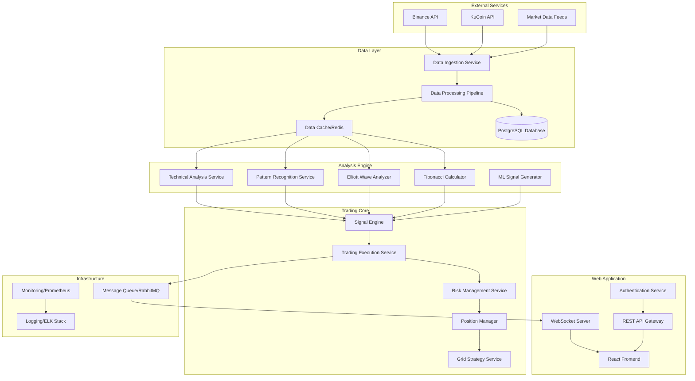

# Design Document

## Overview

The AI Crypto Trading Bot & WebApp is designed as a microservices-based system that combines real-time market analysis, advanced pattern recognition, and automated trading execution. The architecture follows a modular approach with clear separation of concerns, enabling scalability, maintainability, and fault tolerance.

The system operates on a event-driven architecture where market data flows through analysis pipelines, generates trading signals, and executes trades while maintaining comprehensive risk controls and user oversight capabilities.

## Architecture

### High-Level System Architecture



### Technology Stack

**Backend Services:**
- **Runtime:** Node.js with TypeScript for high-performance async operations
- **Framework:** Express.js for REST APIs, Socket.io for real-time communication
- **Database:** PostgreSQL for transactional data, Redis for caching and real-time data
- **Message Queue:** RabbitMQ for event-driven communication between services
- **Container:** Docker for service containerization and deployment

**Frontend Application:**
- **Framework:** React 18 with TypeScript for type-safe development
- **State Management:** Redux Toolkit for complex state management
- **UI Library:** Material-UI with custom trading-focused components
- **Charts:** TradingView Charting Library for professional-grade charts
- **Real-time:** Socket.io client for live data updates

**Infrastructure:**
- **Orchestration:** Docker Compose for development, Kubernetes for production
- **Monitoring:** Prometheus + Grafana for metrics, ELK stack for logging
- **Security:** JWT authentication, API rate limiting, encrypted data storage
- **Deployment:** CI/CD pipeline with automated testing and deployment

## Components and Interfaces

### 1. Data Ingestion Service

**Purpose:** Collect and normalize market data from multiple exchanges

**Key Components:**
- Exchange API connectors with rate limiting and retry logic
- Data validation and normalization pipeline
- Real-time WebSocket connections for live price feeds
- Historical data fetching and backfill capabilities

**Interfaces:**
```typescript
interface MarketDataService {
  subscribeToTicker(symbol: string, exchange: string): Observable<TickerData>
  subscribeToOrderBook(symbol: string, exchange: string): Observable<OrderBookData>
  subscribeToTrades(symbol: string, exchange: string): Observable<TradeData>
  getHistoricalCandles(symbol: string, timeframe: string, limit: number): Promise<CandleData[]>
}

interface TickerData {
  symbol: string
  exchange: string
  price: number
  volume: number
  timestamp: number
  bid: number
  ask: number
}
```

### 2. Technical Analysis Service

**Purpose:** Perform comprehensive technical analysis on market data

**Key Components:**
- Indicator calculation engine (RSI, MACD, Wave Trend, PVT)
- Multi-timeframe analysis coordinator
- Support/resistance level detection
- Market regime classification (trending vs ranging)

**Interfaces:**
```typescript
interface TechnicalAnalysisService {
  calculateIndicators(candles: CandleData[], indicators: string[]): Promise<IndicatorResults>
  detectSupportResistance(candles: CandleData[]): Promise<SRLevel[]>
  classifyMarketRegime(candles: CandleData[]): Promise<MarketRegime>
  getMultiTimeframeAnalysis(symbol: string): Promise<MTFAnalysis>
}

interface IndicatorResults {
  rsi: number[]
  waveTrend: WaveTrendData[]
  pvt: number[]
  supportLevels: number[]
  resistanceLevels: number[]
}
```

### 3. Pattern Recognition Service

**Purpose:** Identify candlestick patterns and chart formations

**Key Components:**
- Candlestick pattern detection algorithms
- Pattern strength scoring system
- Multi-timeframe pattern validation
- Pattern invalidation monitoring

**Interfaces:**
```typescript
interface PatternRecognitionService {
  detectCandlestickPatterns(candles: CandleData[]): Promise<CandlestickPattern[]>
  scorePatternStrength(pattern: CandlestickPattern, context: MarketContext): number
  validatePatternAcrossTimeframes(pattern: CandlestickPattern, symbol: string): Promise<boolean>
}

interface CandlestickPattern {
  type: PatternType
  confidence: number
  startIndex: number
  endIndex: number
  direction: 'bullish' | 'bearish'
  strength: 'weak' | 'moderate' | 'strong'
}
```

### 4. Elliott Wave Analyzer

**Purpose:** Perform Elliott Wave analysis and wave structure identification

**Key Components:**
- Wave structure detection algorithms
- Wave degree classification system
- Fibonacci wave relationship calculator
- Wave invalidation rules engine

**Interfaces:**
```typescript
interface ElliottWaveService {
  analyzeWaveStructure(candles: CandleData[]): Promise<WaveStructure>
  classifyWaveDegree(wave: Wave): WaveDegree
  calculateWaveTargets(currentWave: Wave): Promise<WaveTarget[]>
  validateWaveStructure(structure: WaveStructure): boolean
}

interface WaveStructure {
  waves: Wave[]
  currentWave: Wave
  waveCount: number
  degree: WaveDegree
  validity: number
  nextTargets: WaveTarget[]
}
```

### 5. Fibonacci Calculator

**Purpose:** Calculate Fibonacci retracements, extensions, and confluence zones

**Key Components:**
- Retracement level calculator
- Extension level calculator
- Time-based Fibonacci analysis
- Confluence zone detector

**Interfaces:**
```typescript
interface FibonacciService {
  calculateRetracements(high: number, low: number): FibonacciLevels
  calculateExtensions(wave1: Wave, wave2: Wave): FibonacciLevels
  findConfluenceZones(levels: FibonacciLevels[]): ConfluenceZone[]
  calculateTimeFibonacci(startTime: number, endTime: number): TimeFibonacci
}

interface FibonacciLevels {
  levels: { ratio: number; price: number; type: 'retracement' | 'extension' }[]
  highPrice: number
  lowPrice: number
  confluenceZones: ConfluenceZone[]
}
```

### 6. Signal Engine

**Purpose:** Aggregate analysis results and generate trading signals

**Key Components:**
- Multi-dimensional signal scoring system
- Confluence detection algorithm
- Signal confidence calculation
- Signal filtering and validation

**Interfaces:**
```typescript
interface SignalEngine {
  generateSignal(analysisResults: AnalysisResults): Promise<TradingSignal>
  calculateConfidence(signal: TradingSignal): number
  validateSignal(signal: TradingSignal): boolean
  filterSignals(signals: TradingSignal[], filters: SignalFilter[]): TradingSignal[]
}

interface TradingSignal {
  symbol: string
  direction: 'long' | 'short'
  confidence: number
  entryPrice: number
  stopLoss: number
  takeProfit: number[]
  reasoning: SignalReasoning
  timestamp: number
}
```

### 7. Trading Execution Service

**Purpose:** Execute trades based on generated signals

**Key Components:**
- Order management system
- Exchange routing logic
- Slippage protection
- Order status monitoring

**Interfaces:**
```typescript
interface TradingExecutionService {
  executeSignal(signal: TradingSignal, positionSize: number): Promise<ExecutionResult>
  placeOrder(order: OrderRequest): Promise<OrderResponse>
  cancelOrder(orderId: string, exchange: string): Promise<boolean>
  getOrderStatus(orderId: string, exchange: string): Promise<OrderStatus>
}

interface OrderRequest {
  symbol: string
  side: 'buy' | 'sell'
  type: 'market' | 'limit' | 'stop'
  quantity: number
  price?: number
  stopPrice?: number
  exchange: string
}
```

### 8. Risk Management Service

**Purpose:** Enforce risk controls and position sizing

**Key Components:**
- Position sizing calculator
- Risk limit enforcement
- Drawdown monitoring
- Emergency shutdown system

**Interfaces:**
```typescript
interface RiskManagementService {
  calculatePositionSize(signal: TradingSignal, accountBalance: number): number
  validateRiskLimits(position: Position): RiskValidation
  monitorDrawdown(portfolio: Portfolio): DrawdownStatus
  executeEmergencyShutdown(reason: string): Promise<void>
}

interface RiskValidation {
  isValid: boolean
  violations: RiskViolation[]
  maxAllowedSize: number
  riskPercentage: number
}
```

### 9. Grid Strategy Service

**Purpose:** Implement advanced grid trading strategies

**Key Components:**
- Elliott Wave-based grid calculator
- Fibonacci grid spacing algorithm
- Dynamic grid adjustment system
- Grid performance tracker

**Interfaces:**
```typescript
interface GridStrategyService {
  calculateGridLevels(analysis: AnalysisResults, basePrice: number): GridLevel[]
  adjustGridLevels(currentGrid: Grid, marketConditions: MarketConditions): GridLevel[]
  monitorGridPerformance(grid: Grid): GridPerformance
  closeGrid(gridId: string, reason: string): Promise<GridCloseResult>
}

interface GridLevel {
  price: number
  quantity: number
  side: 'buy' | 'sell'
  orderId?: string
  filled: boolean
  fibonacciLevel?: number
  waveContext?: WaveContext
}
```

## Data Models

### Core Trading Models

```typescript
// Market Data Models
interface CandleData {
  symbol: string
  timeframe: string
  timestamp: number
  open: number
  high: number
  low: number
  close: number
  volume: number
}

interface OrderBookData {
  symbol: string
  exchange: string
  timestamp: number
  bids: [number, number][] // [price, quantity]
  asks: [number, number][]
}

// Analysis Models
interface AnalysisResults {
  technical: TechnicalIndicators
  patterns: CandlestickPattern[]
  elliottWave: WaveStructure
  fibonacci: FibonacciLevels
  confluence: ConfluenceZone[]
  marketRegime: MarketRegime
}

interface TechnicalIndicators {
  rsi: number
  waveTrend: { wt1: number; wt2: number; signal: string }
  pvt: number
  supportLevels: number[]
  resistanceLevels: number[]
  trend: 'bullish' | 'bearish' | 'sideways'
}

// Trading Models
interface Position {
  id: string
  symbol: string
  side: 'long' | 'short'
  size: number
  entryPrice: number
  currentPrice: number
  unrealizedPnl: number
  stopLoss?: number
  takeProfit?: number[]
  timestamp: number
}

interface Portfolio {
  totalBalance: number
  availableBalance: number
  positions: Position[]
  totalUnrealizedPnl: number
  totalRealizedPnl: number
  maxDrawdown: number
  currentDrawdown: number
}

// Grid Trading Models
interface Grid {
  id: string
  symbol: string
  strategy: 'elliott-wave' | 'fibonacci' | 'standard'
  levels: GridLevel[]
  basePrice: number
  spacing: number
  totalProfit: number
  status: 'active' | 'paused' | 'closed'
  createdAt: number
}
```

### Database Schema

```sql
-- Users and Authentication
CREATE TABLE users (
  id UUID PRIMARY KEY DEFAULT gen_random_uuid(),
  email VARCHAR(255) UNIQUE NOT NULL,
  password_hash VARCHAR(255) NOT NULL,
  api_keys JSONB,
  risk_settings JSONB,
  created_at TIMESTAMP DEFAULT NOW(),
  updated_at TIMESTAMP DEFAULT NOW()
);

-- Trading Signals
CREATE TABLE trading_signals (
  id UUID PRIMARY KEY DEFAULT gen_random_uuid(),
  user_id UUID REFERENCES users(id),
  symbol VARCHAR(20) NOT NULL,
  direction VARCHAR(10) NOT NULL,
  confidence DECIMAL(5,2) NOT NULL,
  entry_price DECIMAL(20,8) NOT NULL,
  stop_loss DECIMAL(20,8),
  take_profit JSONB,
  reasoning JSONB,
  status VARCHAR(20) DEFAULT 'pending',
  created_at TIMESTAMP DEFAULT NOW()
);

-- Trade Executions
CREATE TABLE trade_executions (
  id UUID PRIMARY KEY DEFAULT gen_random_uuid(),
  signal_id UUID REFERENCES trading_signals(id),
  user_id UUID REFERENCES users(id),
  symbol VARCHAR(20) NOT NULL,
  side VARCHAR(10) NOT NULL,
  quantity DECIMAL(20,8) NOT NULL,
  price DECIMAL(20,8) NOT NULL,
  fee DECIMAL(20,8),
  exchange VARCHAR(50) NOT NULL,
  order_id VARCHAR(100),
  executed_at TIMESTAMP DEFAULT NOW()
);

-- Grid Trading
CREATE TABLE grids (
  id UUID PRIMARY KEY DEFAULT gen_random_uuid(),
  user_id UUID REFERENCES users(id),
  symbol VARCHAR(20) NOT NULL,
  strategy VARCHAR(50) NOT NULL,
  levels JSONB NOT NULL,
  base_price DECIMAL(20,8) NOT NULL,
  spacing DECIMAL(10,4) NOT NULL,
  total_profit DECIMAL(20,8) DEFAULT 0,
  status VARCHAR(20) DEFAULT 'active',
  created_at TIMESTAMP DEFAULT NOW(),
  updated_at TIMESTAMP DEFAULT NOW()
);

-- Performance Analytics
CREATE TABLE performance_metrics (
  id UUID PRIMARY KEY DEFAULT gen_random_uuid(),
  user_id UUID REFERENCES users(id),
  metric_type VARCHAR(50) NOT NULL,
  metric_value DECIMAL(20,8) NOT NULL,
  metadata JSONB,
  calculated_at TIMESTAMP DEFAULT NOW()
);
```

## Error Handling

### Error Classification System

**Level 1 - Critical Errors:**
- Exchange API failures
- Database connection losses
- Risk limit violations
- Security breaches

**Level 2 - Operational Errors:**
- Order execution failures
- Data validation errors
- Signal generation failures
- Grid strategy errors

**Level 3 - Warning Conditions:**
- High latency conditions
- Data quality issues
- Performance degradation
- Configuration warnings

### Error Handling Strategies

```typescript
class ErrorHandler {
  static async handleCriticalError(error: CriticalError): Promise<void> {
    // Immediate system shutdown for critical errors
    await this.emergencyShutdown(error.reason)
    await this.notifyAdministrators(error)
    await this.logCriticalError(error)
  }

  static async handleOperationalError(error: OperationalError): Promise<void> {
    // Retry logic with exponential backoff
    const maxRetries = 3
    for (let i = 0; i < maxRetries; i++) {
      try {
        await this.retryOperation(error.operation)
        break
      } catch (retryError) {
        if (i === maxRetries - 1) {
          await this.escalateError(error)
        }
        await this.delay(Math.pow(2, i) * 1000)
      }
    }
  }

  static async handleWarningCondition(warning: Warning): Promise<void> {
    // Log warning and adjust system parameters
    await this.logWarning(warning)
    await this.adjustSystemParameters(warning.type)
    await this.notifyUsers(warning)
  }
}
```

### Circuit Breaker Pattern

```typescript
class CircuitBreaker {
  private failureCount = 0
  private lastFailureTime = 0
  private state: 'closed' | 'open' | 'half-open' = 'closed'

  async execute<T>(operation: () => Promise<T>): Promise<T> {
    if (this.state === 'open') {
      if (Date.now() - this.lastFailureTime > this.timeout) {
        this.state = 'half-open'
      } else {
        throw new Error('Circuit breaker is open')
      }
    }

    try {
      const result = await operation()
      this.onSuccess()
      return result
    } catch (error) {
      this.onFailure()
      throw error
    }
  }

  private onSuccess(): void {
    this.failureCount = 0
    this.state = 'closed'
  }

  private onFailure(): void {
    this.failureCount++
    this.lastFailureTime = Date.now()
    if (this.failureCount >= this.threshold) {
      this.state = 'open'
    }
  }
}
```

## Testing Strategy

### Unit Testing
- **Coverage Target:** 90% code coverage for all services
- **Framework:** Jest with TypeScript support
- **Focus Areas:** Business logic, calculations, data transformations
- **Mocking:** External APIs, database connections, message queues

### Integration Testing
- **Scope:** Service-to-service communication, database operations
- **Tools:** Supertest for API testing, Testcontainers for database testing
- **Scenarios:** End-to-end signal generation and execution flows
- **Data:** Realistic market data scenarios and edge cases

### Performance Testing
- **Load Testing:** Simulate high-frequency market data processing
- **Stress Testing:** Test system behavior under extreme conditions
- **Latency Testing:** Ensure sub-100ms response times for critical operations
- **Tools:** Artillery.js for load testing, custom benchmarking scripts

### Security Testing
- **Authentication:** JWT token validation and expiration
- **Authorization:** Role-based access control testing
- **Input Validation:** SQL injection, XSS prevention
- **API Security:** Rate limiting, request validation

### End-to-End Testing
- **User Workflows:** Complete trading scenarios from signal to execution
- **Browser Testing:** Cross-browser compatibility for web interface
- **Mobile Testing:** Responsive design and functionality
- **Tools:** Playwright for browser automation

### Testing Data Strategy

```typescript
// Test Data Factory
class TestDataFactory {
  static createMarketData(options: MarketDataOptions): CandleData[] {
    // Generate realistic OHLCV data with configurable patterns
    return this.generateCandles(options)
  }

  static createElliottWaveScenario(waveType: WaveType): CandleData[] {
    // Generate price data that follows Elliott Wave patterns
    return this.generateWavePattern(waveType)
  }

  static createFibonacciTestData(scenario: FibonacciScenario): CandleData[] {
    // Generate data with clear Fibonacci retracement/extension levels
    return this.generateFibonacciPattern(scenario)
  }
}

// Mock Services
class MockExchangeAPI {
  async getOrderBook(symbol: string): Promise<OrderBookData> {
    return TestDataFactory.createOrderBook(symbol)
  }

  async placeOrder(order: OrderRequest): Promise<OrderResponse> {
    return TestDataFactory.createOrderResponse(order)
  }
}
```

This comprehensive design provides a solid foundation for building the AI Crypto Trading Bot system with proper separation of concerns, scalability, and maintainability while addressing all the requirements from the specification.