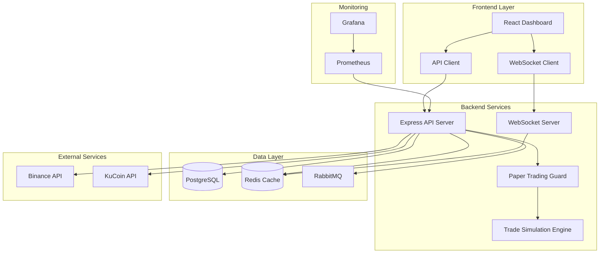
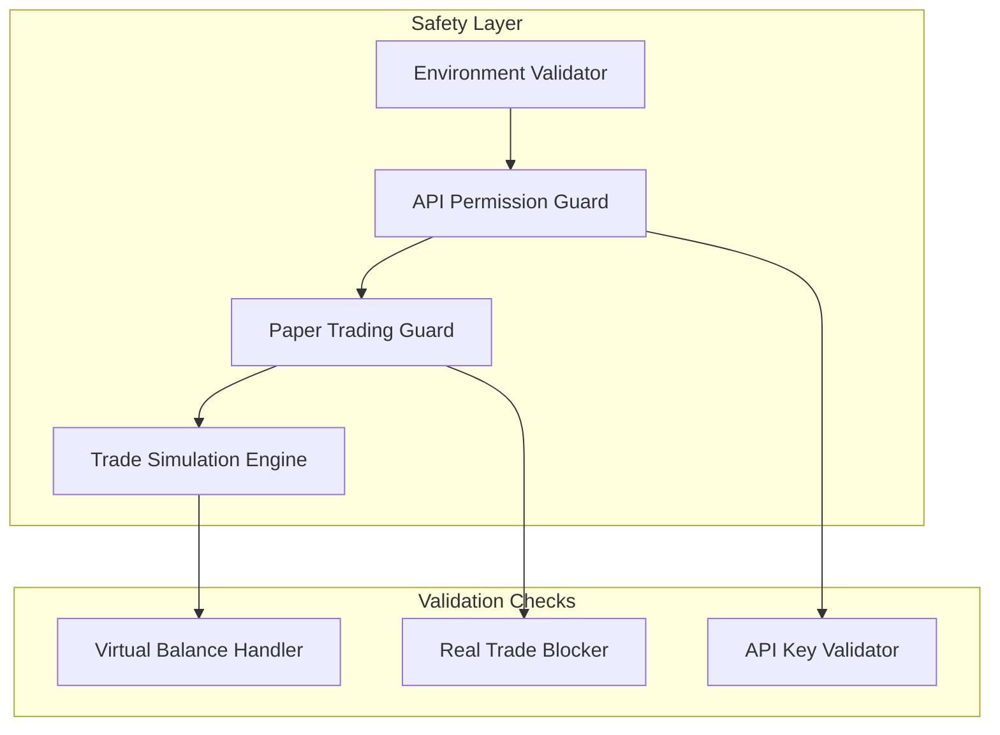

# Design Document

## Overview

This design addresses the critical deployment issues identified in the AI Crypto Trading Bot project and implements a robust solution for live market data integration with secure paper trading functionality. The solution focuses on fixing 14 critical issues while ensuring the system operates safely in paper trading mode with real-time market data.

## Architecture

### System Architecture Overview



### Paper Trading Safety Architecture



## Components and Interfaces

### 1. Paper Trading Safety Components

#### Environment Safety Validator
```typescript
interface EnvironmentSafetyValidator {
  validatePaperTradingMode(): boolean;
  checkTradingSimulationOnly(): boolean;
  validateApiKeyRestrictions(): boolean;
  calculateSafetyScore(): number;
}
```

#### Paper Trading Guard Middleware
```typescript
interface PaperTradingGuard {
  blockRealTrades(req: Request, res: Response, next: NextFunction): void;
  validateTradeRequest(tradeData: TradeRequest): ValidationResult;
  throwRealTradeError(): never;
  logPaperTradeAttempt(tradeData: TradeRequest): void;
}
```

#### Trade Simulation Engine
```typescript
interface TradeSimulationEngine {
  simulateTrade(tradeRequest: TradeRequest): SimulatedTradeResult;
  updateVirtualBalance(userId: string, trade: SimulatedTrade): void;
  calculateTradingFees(amount: number, feeRate: number): number;
  applySlippageSimulation(price: number, slippage: number): number;
}
```

### 2. Live Market Data Components

#### Market Data Service
```typescript
interface LiveMarketDataService {
  connectToBinance(): Promise<WebSocket>;
  connectToKuCoin(): Promise<WebSocket>;
  subscribeToSymbol(symbol: string): void;
  handlePriceUpdate(data: PriceData): void;
  cacheMarketData(symbol: string, data: MarketData): void;
}
```

#### WebSocket Manager
```typescript
interface WebSocketManager {
  establishConnection(exchange: string): Promise<WebSocket>;
  handleReconnection(exchange: string): void;
  subscribeToStreams(symbols: string[]): void;
  broadcastToClients(data: MarketData): void;
}
```

### 3. Frontend Integration Components

#### Real-time Chart Component
```typescript
interface RealTimeChart {
  updatePriceData(priceData: PriceData): void;
  renderTechnicalIndicators(indicators: TechnicalIndicators): void;
  displayPaperTradingStatus(): void;
  handleWebSocketConnection(): void;
}
```

#### Bot Configuration Interface
```typescript
interface BotConfigurationPanel {
  loadCurrentSettings(): BotSettings;
  validateConfiguration(settings: BotSettings): ValidationResult;
  saveConfiguration(settings: BotSettings): Promise<void>;
  displayPaperTradingWarnings(): void;
}
```

### 4. Dependency and Build Components

#### Dependency Manager
```typescript
interface DependencyManager {
  validatePrismaInstallation(): boolean;
  checkJestConfiguration(): boolean;
  verifyTypeScriptCompilation(): boolean;
  installMissingDependencies(): Promise<void>;
}
```

#### Docker Build Manager
```typescript
interface DockerBuildManager {
  buildFrontendImage(): Promise<BuildResult>;
  buildBackendImage(): Promise<BuildResult>;
  validateDockerCompose(): boolean;
  createMissingDockerfiles(): void;
}
```

## Data Models

### Paper Trading Models

```typescript
interface VirtualPortfolio {
  userId: string;
  balances: {
    [currency: string]: number;
  };
  totalValue: number;
  unrealizedPnL: number;
  realizedPnL: number;
  createdAt: Date;
  updatedAt: Date;
}

interface SimulatedTrade {
  id: string;
  userId: string;
  symbol: string;
  side: 'buy' | 'sell';
  amount: number;
  price: number;
  fee: number;
  slippage: number;
  executedAt: Date;
  status: 'executed' | 'failed';
}
```

### Market Data Models

```typescript
interface LiveMarketData {
  symbol: string;
  price: number;
  volume: number;
  change24h: number;
  high24h: number;
  low24h: number;
  timestamp: Date;
  exchange: string;
}

interface TechnicalIndicators {
  rsi: number;
  macd: {
    macd: number;
    signal: number;
    histogram: number;
  };
  bollinger: {
    upper: number;
    middle: number;
    lower: number;
  };
  volume: number;
}
```

### Configuration Models

```typescript
interface SystemConfiguration {
  paperTradingMode: boolean;
  allowRealTrades: boolean;
  tradingSimulationOnly: boolean;
  monitoringEnabled: boolean;
  sslEnabled: boolean;
  apiKeyRestrictions: {
    binanceReadOnly: boolean;
    kucoinReadOnly: boolean;
  };
}

interface DeploymentConfiguration {
  environment: 'development' | 'production';
  dockerComposeFile: string;
  sslCertificates: {
    certPath: string;
    keyPath: string;
    caPath: string;
  };
  monitoring: {
    prometheusEnabled: boolean;
    grafanaEnabled: boolean;
  };
}
```

## Error Handling

### Paper Trading Safety Errors

```typescript
class RealTradingAttemptError extends Error {
  constructor(message: string) {
    super(`PAPER TRADING VIOLATION: ${message}`);
    this.name = 'RealTradingAttemptError';
  }
}

class UnsafeEnvironmentError extends Error {
  constructor(variable: string, expected: string, actual: string) {
    super(`Unsafe environment: ${variable} should be ${expected}, got ${actual}`);
    this.name = 'UnsafeEnvironmentError';
  }
}
```

### Deployment Errors

```typescript
class MissingDependencyError extends Error {
  constructor(dependency: string) {
    super(`Missing required dependency: ${dependency}`);
    this.name = 'MissingDependencyError';
  }
}

class ConfigurationError extends Error {
  constructor(config: string, issue: string) {
    super(`Configuration error in ${config}: ${issue}`);
    this.name = 'ConfigurationError';
  }
}
```

### Market Data Errors

```typescript
class MarketDataConnectionError extends Error {
  constructor(exchange: string, reason: string) {
    super(`Failed to connect to ${exchange}: ${reason}`);
    this.name = 'MarketDataConnectionError';
  }
}

class WebSocketReconnectionError extends Error {
  constructor(attempts: number) {
    super(`WebSocket reconnection failed after ${attempts} attempts`);
    this.name = 'WebSocketReconnectionError';
  }
}
```

## Testing Strategy

### Paper Trading Safety Testing

1. **Environment Validation Tests**
   - Verify TRADING_SIMULATION_ONLY is enforced
   - Test API key restriction validation
   - Validate safety score calculation

2. **Trade Blocking Tests**
   - Test real trade attempt blocking
   - Verify error throwing for unsafe operations
   - Validate virtual balance handling

3. **Integration Safety Tests**
   - End-to-end paper trading workflow
   - API permission validation
   - Trade simulation accuracy

### Deployment Testing

1. **Dependency Tests**
   - Prisma installation validation
   - Jest configuration testing
   - TypeScript compilation verification

2. **Docker Build Tests**
   - Frontend image build validation
   - Backend image build verification
   - Docker Compose configuration testing

3. **Environment Tests**
   - Production configuration validation
   - SSL certificate verification
   - Monitoring service connectivity

### Live Data Testing

1. **Market Data Tests**
   - Binance WebSocket connection testing
   - KuCoin API integration testing
   - Real-time data flow validation

2. **Frontend Integration Tests**
   - Chart update functionality
   - WebSocket client connectivity
   - User interface responsiveness

3. **Performance Tests**
   - Load testing with live data streams
   - Memory usage optimization
   - Connection stability testing

## Implementation Phases

### Phase 1: Critical Safety Fixes
1. Fix environment variable validation
2. Implement proper paper trading guards
3. Create trade simulation engine
4. Add API permission validators

### Phase 2: Dependency and Build Fixes
1. Install missing dependencies (Prisma, Jest)
2. Fix TypeScript compilation errors
3. Create missing Docker files
4. Update production configurations

### Phase 3: Live Market Data Integration
1. Implement Binance WebSocket connections
2. Add KuCoin API integration
3. Create real-time data caching
4. Build market data processing pipeline

### Phase 4: Frontend Functionality
1. Fix React component rendering
2. Implement real-time chart updates
3. Add bot configuration interface
4. Create paper trading status indicators

### Phase 5: Production Deployment
1. Configure SSL certificates
2. Set up monitoring services
3. Implement health checks
4. Deploy to production environment

### Phase 6: Testing and Validation
1. Run comprehensive integration tests
2. Perform load testing
3. Execute security validation
4. Conduct user acceptance testing

This design provides a comprehensive solution to address all critical deployment issues while implementing robust live market data functionality with secure paper trading capabilities.