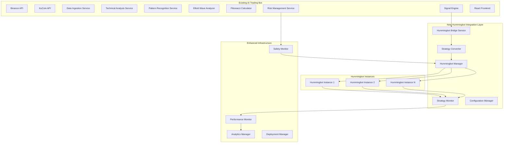

# Design Document

## Overview

The Hummingbot Integration Enhancement extends the existing AI Crypto Trading Bot with seamless integration to Hummingbot for professional-grade trade execution. This design maintains the existing architecture while adding a new integration layer that bridges the sophisticated analysis engine with Hummingbot's execution capabilities.

## Architecture

### Enhanced System Architecture



### Technology Stack Enhancements

**New Components:**
- **Hummingbot API Client:** Python/TypeScript client for Hummingbot Gateway API
- **Strategy Translation Engine:** Converts AI signals to Hummingbot configurations
- **Multi-Instance Manager:** Coordinates multiple Hummingbot instances
- **Performance Analytics:** Enhanced metrics collection and analysis
- **Configuration Validator:** Ensures Hummingbot compatibility

**Integration Technologies:**
- **Hummingbot Gateway:** RESTful API for Hummingbot control
- **WebSocket Streams:** Real-time strategy monitoring
- **Docker Orchestration:** Containerized Hummingbot deployment
- **Message Queues:** Reliable communication between components

## Components and Interfaces

### 1. Hummingbot Bridge Service

**Purpose:** Central coordination point for all Hummingbot interactions

**Key Components:**
- API client for Hummingbot Gateway
- Connection pool management
- Authentication and security handling
- Error handling and retry logic

**Interfaces:**
```typescript
interface HummingbotBridgeService {
  connectToHummingbot(instanceId: string, config: HBConfig): Promise<HBConnection>
  executeStrategy(strategy: TradingStrategy): Promise<StrategyExecution>
  monitorStrategy(strategyId: string): Observable<StrategyStatus>
  stopStrategy(strategyId: string): Promise<boolean>
  getPerformanceMetrics(strategyId: string): Promise<PerformanceMetrics>
}

interface HBConnection {
  instanceId: string
  status: 'connected' | 'disconnected' | 'error'
  lastPing: number
  apiVersion: string
  supportedStrategies: string[]
}
```

### 2. Strategy Converter

**Purpose:** Translate AI trading signals into Hummingbot strategy configurations

**Key Components:**
- Signal-to-strategy mapping engine
- Parameter optimization algorithms
- Strategy template management
- Validation and testing framework

**Interfaces:**
```typescript
interface StrategyConverter {
  convertSignal(signal: TradingSignal, context: MarketContext): Promise<HBStrategy>
  optimizeParameters(strategy: HBStrategy, historical: HistoricalData): Promise<HBStrategy>
  validateStrategy(strategy: HBStrategy): Promise<ValidationResult>
  getStrategyTemplate(signalType: SignalType): HBStrategyTemplate
}

interface HBStrategy {
  type: 'pure_market_making' | 'cross_exchange_market_making' | 'arbitrage' | 'grid_trading'
  exchange: string
  tradingPair: string
  parameters: Record<string, any>
  riskLimits: RiskLimits
  executionSettings: ExecutionSettings
}
```

### 3. Hummingbot Manager

**Purpose:** Manage multiple Hummingbot instances and coordinate their operations

**Key Components:**
- Instance lifecycle management
- Load balancing and resource allocation
- Health monitoring and recovery
- Configuration synchronization

**Interfaces:**
```typescript
interface HummingbotManager {
  createInstance(config: InstanceConfig): Promise<HBInstance>
  deployStrategy(instanceId: string, strategy: HBStrategy): Promise<Deployment>
  scaleInstances(targetCount: number): Promise<ScalingResult>
  healthCheck(): Promise<HealthStatus[]>
  rebalanceLoad(): Promise<RebalanceResult>
}

interface HBInstance {
  id: string
  status: InstanceStatus
  strategies: ActiveStrategy[]
  resources: ResourceUsage
  performance: InstancePerformance
}
```

### 4. Strategy Monitor

**Purpose:** Real-time monitoring and control of active Hummingbot strategies

**Key Components:**
- Real-time status tracking
- Performance metrics collection
- Alert and notification system
- Automatic adjustment triggers

**Interfaces:**
```typescript
interface StrategyMonitor {
  trackStrategy(strategyId: string): Observable<StrategyMetrics>
  detectAnomalies(metrics: StrategyMetrics[]): Promise<Anomaly[]>
  triggerAdjustment(strategyId: string, adjustment: StrategyAdjustment): Promise<boolean>
  generateAlerts(conditions: AlertCondition[]): Observable<Alert>
}

interface StrategyMetrics {
  strategyId: string
  executionLatency: number
  fillRate: number
  slippage: number
  profitLoss: number
  riskExposure: number
  timestamp: number
}
```

### 5. Configuration Manager

**Purpose:** Manage Hummingbot configurations and ensure compatibility

**Key Components:**
- Configuration template library
- Parameter validation engine
- Version compatibility checker
- Backup and restore functionality

**Interfaces:**
```typescript
interface ConfigurationManager {
  createConfiguration(template: ConfigTemplate, params: ConfigParams): Promise<HBConfig>
  validateConfiguration(config: HBConfig): Promise<ValidationResult>
  saveConfiguration(config: HBConfig): Promise<string>
  loadConfiguration(configId: string): Promise<HBConfig>
  migrateConfiguration(config: HBConfig, targetVersion: string): Promise<HBConfig>
}

interface HBConfig {
  version: string
  instanceSettings: InstanceSettings
  strategyConfigs: StrategyConfig[]
  exchangeSettings: ExchangeSettings
  riskSettings: RiskSettings
}
```

## Data Models

### Enhanced Trading Models

```typescript
// Hummingbot Integration Models
interface HummingbotIntegration {
  enabled: boolean
  instances: HBInstance[]
  defaultSettings: HBDefaultSettings
  performanceMetrics: HBPerformanceMetrics
  lastSync: number
}

interface StrategyExecution {
  id: string
  strategyType: string
  instanceId: string
  status: 'pending' | 'active' | 'paused' | 'stopped' | 'error'
  startTime: number
  endTime?: number
  parameters: Record<string, any>
  performance: ExecutionPerformance
}

interface ExecutionPerformance {
  totalTrades: number
  successfulTrades: number
  totalVolume: number
  totalPnL: number
  averageLatency: number
  averageSlippage: number
  fillRate: number
}

// Enhanced Signal Models
interface EnhancedTradingSignal extends TradingSignal {
  hummingbotStrategy?: HBStrategy
  executionMethod: 'direct' | 'hummingbot' | 'hybrid'
  strategyId?: string
  instanceId?: string
}

// Configuration Models
interface DeploymentConfig {
  environment: 'development' | 'staging' | 'production'
  hummingbotEnabled: boolean
  instanceCount: number
  resourceLimits: ResourceLimits
  scalingPolicy: ScalingPolicy
  monitoringConfig: MonitoringConfig
}
```

### Database Schema Extensions

```sql
-- Hummingbot Integration Tables
CREATE TABLE hummingbot_instances (
  id UUID PRIMARY KEY DEFAULT gen_random_uuid(),
  name VARCHAR(100) NOT NULL,
  status VARCHAR(20) NOT NULL,
  config JSONB NOT NULL,
  created_at TIMESTAMP DEFAULT NOW(),
  updated_at TIMESTAMP DEFAULT NOW()
);

CREATE TABLE hummingbot_strategies (
  id UUID PRIMARY KEY DEFAULT gen_random_uuid(),
  instance_id UUID REFERENCES hummingbot_instances(id),
  signal_id UUID REFERENCES trading_signals(id),
  strategy_type VARCHAR(50) NOT NULL,
  parameters JSONB NOT NULL,
  status VARCHAR(20) NOT NULL,
  performance_metrics JSONB,
  created_at TIMESTAMP DEFAULT NOW(),
  updated_at TIMESTAMP DEFAULT NOW()
);

CREATE TABLE strategy_executions (
  id UUID PRIMARY KEY DEFAULT gen_random_uuid(),
  strategy_id UUID REFERENCES hummingbot_strategies(id),
  execution_data JSONB NOT NULL,
  performance_data JSONB,
  executed_at TIMESTAMP DEFAULT NOW()
);

CREATE TABLE deployment_configs (
  id UUID PRIMARY KEY DEFAULT gen_random_uuid(),
  environment VARCHAR(20) NOT NULL,
  config JSONB NOT NULL,
  version VARCHAR(20) NOT NULL,
  deployed_at TIMESTAMP DEFAULT NOW()
);
```

## Integration Patterns

### 1. Strategy Translation Pattern

```typescript
class StrategyTranslationEngine {
  async translateElliottWaveSignal(signal: ElliottWaveSignal): Promise<HBStrategy> {
    const waveType = signal.waveStructure.currentWave.type;
    
    if (waveType === 'impulse') {
      return this.createGridStrategy({
        direction: 'long',
        levels: signal.fibonacciLevels,
        spacing: this.calculateOptimalSpacing(signal)
      });
    } else {
      return this.createMarketMakingStrategy({
        spread: this.calculateSpreadFromVolatility(signal.volatility),
        orderAmount: this.calculateOrderSize(signal.confidence)
      });
    }
  }
}
```

### 2. Multi-Instance Coordination Pattern

```typescript
class InstanceCoordinator {
  async coordinateStrategies(strategies: HBStrategy[]): Promise<CoordinationResult> {
    const instances = await this.getAvailableInstances();
    const assignments = this.optimizeAssignments(strategies, instances);
    
    const deployments = await Promise.all(
      assignments.map(assignment => 
        this.deployToInstance(assignment.strategy, assignment.instance)
      )
    );
    
    return {
      deployments,
      coordination: this.setupCoordination(deployments)
    };
  }
}
```

### 3. Failover Pattern

```typescript
class ExecutionFailover {
  async executeWithFailover(signal: TradingSignal): Promise<ExecutionResult> {
    try {
      // Primary: Try Hummingbot execution
      return await this.hummingbotExecution(signal);
    } catch (hbError) {
      this.logger.warn('Hummingbot execution failed, falling back to direct execution', hbError);
      
      try {
        // Fallback: Direct exchange execution
        return await this.directExecution(signal);
      } catch (directError) {
        this.logger.error('Both execution methods failed', { hbError, directError });
        throw new ExecutionError('All execution methods failed');
      }
    }
  }
}
```

## Performance Optimization

### 1. Connection Pooling

```typescript
class HummingbotConnectionPool {
  private connections: Map<string, HBConnection> = new Map();
  private maxConnections = 10;
  private connectionTimeout = 30000;

  async getConnection(instanceId: string): Promise<HBConnection> {
    let connection = this.connections.get(instanceId);
    
    if (!connection || !this.isHealthy(connection)) {
      connection = await this.createConnection(instanceId);
      this.connections.set(instanceId, connection);
    }
    
    return connection;
  }
}
```

### 2. Strategy Caching

```typescript
class StrategyCache {
  private cache = new Map<string, CachedStrategy>();
  private ttl = 300000; // 5 minutes

  async getStrategy(signalHash: string): Promise<HBStrategy | null> {
    const cached = this.cache.get(signalHash);
    
    if (cached && Date.now() - cached.timestamp < this.ttl) {
      return cached.strategy;
    }
    
    return null;
  }
}
```

## Security Considerations

### 1. API Key Management

```typescript
class SecureHummingbotClient {
  private encryptedKeys: Map<string, string> = new Map();
  
  async authenticateInstance(instanceId: string): Promise<AuthResult> {
    const encryptedKey = this.encryptedKeys.get(instanceId);
    const decryptedKey = await this.cryptoService.decrypt(encryptedKey);
    
    return this.hummingbotAPI.authenticate(decryptedKey);
  }
}
```

### 2. Strategy Validation

```typescript
class StrategyValidator {
  async validateStrategy(strategy: HBStrategy): Promise<ValidationResult> {
    const checks = [
      this.validateRiskLimits(strategy),
      this.validateExchangeCompatibility(strategy),
      this.validateParameterRanges(strategy),
      this.validateMarketConditions(strategy)
    ];
    
    const results = await Promise.all(checks);
    return this.aggregateResults(results);
  }
}
```

## Monitoring and Observability

### 1. Enhanced Metrics Collection

```typescript
class HummingbotMetricsCollector {
  collectMetrics(): HBMetrics {
    return {
      instanceMetrics: this.collectInstanceMetrics(),
      strategyMetrics: this.collectStrategyMetrics(),
      performanceMetrics: this.collectPerformanceMetrics(),
      errorMetrics: this.collectErrorMetrics()
    };
  }
}
```

### 2. Real-time Dashboards

```typescript
class HummingbotDashboard {
  setupRealTimeDashboard(): void {
    this.websocketService.broadcast('hummingbot-metrics', {
      instances: this.getInstanceStatus(),
      strategies: this.getActiveStrategies(),
      performance: this.getPerformanceSnapshot()
    });
  }
}
```

This comprehensive design provides a robust foundation for integrating Hummingbot with the existing AI Crypto Trading Bot while maintaining performance, security, and reliability standards.